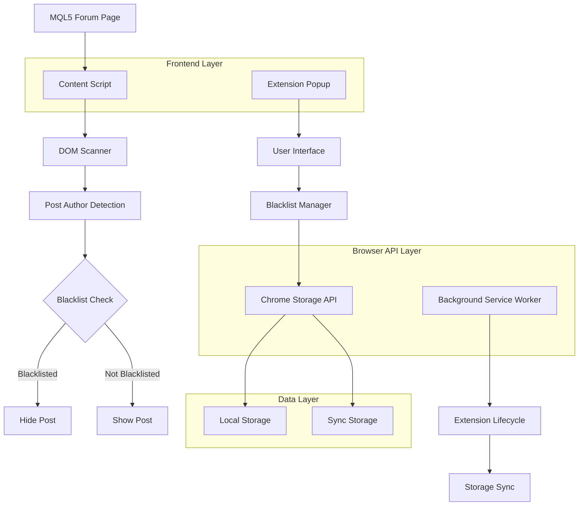
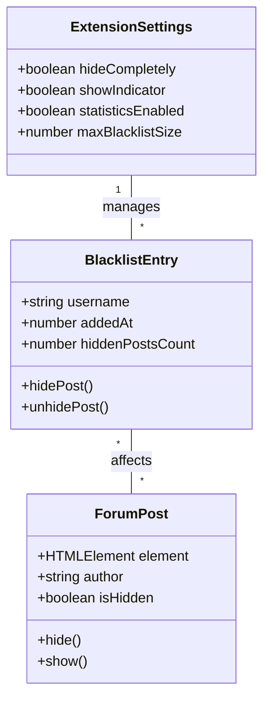

## 1. Architecture design



## 2. Technology Description
- **Frontend**: Vanilla JavaScript (ES6+), HTML5, CSS3
- **Browser APIs**: Chrome Extension Manifest V3 APIs
- **Storage**: Chrome Storage API (local and sync)
- **Permissions**: Active tab, Storage, Host permissions for mql5.com
- **Build Tool**: None (pure extension, no build process required)

## 3. Route definitions
| Component | File | Purpose |
|-----------|------|---------|
| manifest.json | /manifest.json | Extension configuration and permissions |
| content-script.js | /content/content-script.js | Injected into MQL5 forum pages |
| popup.html | /popup/popup.html | Extension popup interface |
| popup.js | /popup/popup.js | Popup functionality |
| options.html | /options/options.html | Options page interface |
| options.js | /options/options.js | Options page functionality |
| background.js | /background/background.js | Service worker for extension lifecycle |

## 4. API definitions

### 4.1 Chrome Storage API
```javascript
// Blacklist data structure
interface BlacklistEntry {
  username: string;
  addedAt: number; // timestamp
  hiddenPostsCount: number;
}

interface ExtensionStorage {
  blacklist: BlacklistEntry[];
  isEnabled: boolean;
  settings: {
    hideCompletely: boolean;
    showIndicator: boolean;
    statisticsEnabled: boolean;
  };
}
```

### 4.2 Content Script Interface
```javascript
// Post detection interface
interface ForumPost {
  element: HTMLElement;
  author: string;
  authorElement: HTMLElement;
  contentElement: HTMLElement;
  isHidden: boolean;
}

// Message passing between content script and popup
interface Message {
  type: 'getStats' | 'togglePost' | 'updateBlacklist';
  payload?: any;
}
```

## 5. Server architecture diagram
Not applicable - this is a client-side only extension with no backend server.

## 6. Data model

### 6.1 Data model definition


### 6.2 Data Definition Language
Not applicable - uses Chrome Storage API instead of traditional database.

Chrome Storage structure:
```javascript
// Default storage structure
const defaultStorage = {
  blacklist: [], // Array of BlacklistEntry objects
  isEnabled: true,
  settings: {
    hideCompletely: true,    // true = remove from DOM, false = display:none
    showIndicator: true,       // Show where posts were hidden
    statisticsEnabled: true,   // Track hidden post statistics
    maxBlacklistSize: 1000   // Maximum number of blacklisted users
  },
  statistics: {
    totalHiddenPosts: 0,
    lastReset: Date.now()
  }
};
```

## 7. Extension Manifest Configuration
```json
{
  "manifest_version": 3,
  "name": "MQL5 Forum User Blacklist",
  "version": "1.0.0",
  "description": "Hide posts from specified users on MQL5 forum",
  "permissions": [
    "storage",
    "activeTab"
  ],
  "host_permissions": [
    "*://www.mql5.com/*"
  ],
  "content_scripts": [
    {
      "matches": ["*://www.mql5.com/*/forum*"],
      "js": ["content/content-script.js"],
      "run_at": "document_end"
    }
  ],
  "action": {
    "default_popup": "popup/popup.html",
    "default_title": "MQL5 Forum Blacklist"
  },
  "options_page": "options/options.html",
  "background": {
    "service_worker": "background/background.js"
  }
}
```

## 8. Security Considerations
- **Content Security Policy**: Strict CSP to prevent XSS attacks
- **Input Validation**: Sanitize all user inputs before storage
- **Origin Isolation**: Content scripts only run on MQL5 domains
- **Storage Encryption**: Chrome Storage API provides built-in encryption
- **Minimal Permissions**: Only request necessary permissions
- **No External Requests**: All processing happens locally