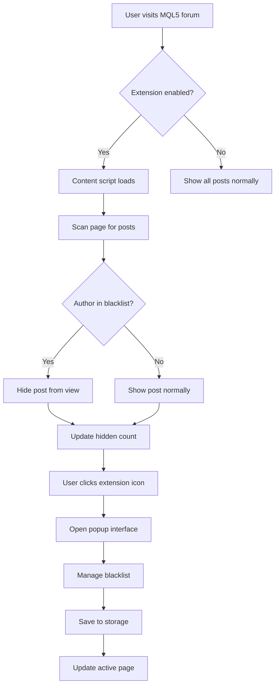

## 1. Product Overview
Chrome browser extension that allows users to create a blacklist of forum users whose posts will be hidden when browsing the MQL5 forum. Works across all language versions of the forum (ru, en, etc.).

The extension helps users filter out unwanted content from specific forum users, improving their browsing experience by hiding posts from blacklisted users on https://www.mql5.com/forum and its language-specific variants.

## 2. Core Features

### 2.1 User Roles
| Role | Registration Method | Core Permissions |
|------|---------------------|------------------|
| Extension User | Automatic upon installation | Can add/remove users from blacklist, toggle extension on/off |

### 2.2 Feature Module
The extension consists of the following main components:
1. **Content Script**: Injects into MQL5 forum pages to hide blacklisted user posts
2. **Popup Interface**: Browser action popup for managing blacklist
3. **Background Script**: Handles extension lifecycle and storage management
4. **Options Page**: Extended settings and blacklist management interface

### 2.3 Page Details
| Component | Module Name | Feature description |
|-----------|-------------|---------------------|
| Content Script | Post Detection | Automatically detects forum posts and their authors on MQL5 forum pages |
| Content Script | Post Hiding | Hides posts from users in the blacklist by removing them from DOM or applying display: none |
| Content Script | Visual Indicators | Shows subtle indicators where posts were hidden |
| Popup Interface | Blacklist Management | Add/remove users from blacklist via simple input field |
| Popup Interface | Quick Toggle | Enable/disable extension functionality temporarily |
| Popup Interface | Statistics | Show count of hidden posts and blacklisted users |
| Options Page | Bulk Management | Import/export blacklist, clear all entries |
| Options Page | Advanced Settings | Configure hiding behavior, whitelist mode |
| Background Script | Storage | Save blacklist to Chrome storage API |
| Background Script | Updates | Handle extension updates gracefully |

## 3. Core Process
**User Flow:**
1. User installs extension from Chrome Web Store or loads unpacked extension
2. User visits any MQL5 forum page (any language version)
3. Extension automatically detects forum posts and their authors
4. If author is in blacklist, their post is hidden from view
5. User can click extension icon to manage blacklist
6. Changes to blacklist take effect immediately on open forum pages

## 4. User Interface Design

### 4.1 Design Style
- **Primary Colors**: Chrome extension standard (Material Design)
- **Secondary Colors**: MQL5 forum color scheme integration
- **Button Style**: Material Design buttons with subtle shadows
- **Font**: System fonts (Roboto for popup, inherit for content script)
- **Layout**: Compact popup (350px width), responsive options page
- **Icons**: Material Design icons for consistency with Chrome

### 4.2 Page Design Overview
| Component | Module Name | UI Elements |
|-----------|-------------|-------------|
| Popup Interface | Header | Extension name, on/off toggle switch |
| Popup Interface | Add User | Text input field, add button |
| Popup Interface | Blacklist | Scrollable list of blacklisted users with remove buttons |
| Popup Interface | Statistics | Count of hidden posts, total blacklisted users |
| Options Page | Header | Extension logo, title, version |
| Options Page | Blacklist Section | Full blacklist with bulk operations |
| Options Page | Import/Export | File upload/download buttons |
| Options Page | Settings | Checkboxes for advanced options |

### 4.3 Responsiveness
- **Desktop-first**: Optimized for desktop Chrome browser usage
- **Popup responsive**: Adapts to different popup sizes
- **Forum integration**: Seamlessly integrates with MQL5 forum layout
- **Touch optimization**: Basic touch support for hybrid devices

### 4.4 Security and Privacy
- **Local storage only**: All data stored locally in browser
- **No external requests**: Extension works offline after installation
- **Minimal permissions**: Only requests access to MQL5 forum domains
- **Transparent operation**: User can see exactly what data is stored